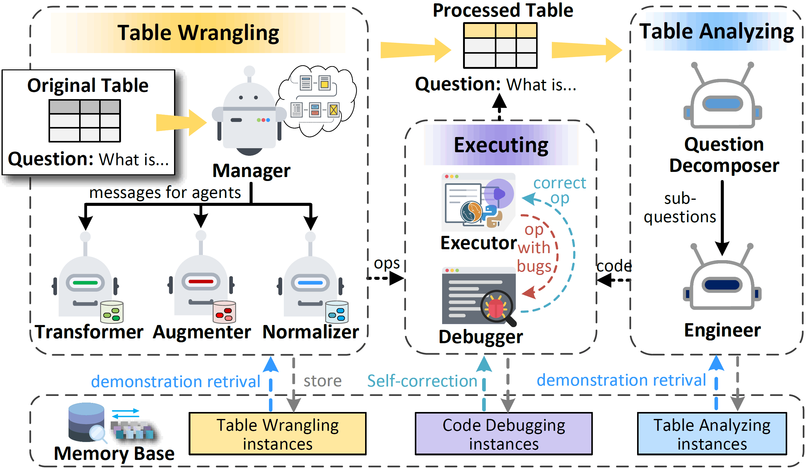

# Multi-Agent Framework for Table Processing


The Multi-Agent Framework for Table Processing (MAFTP) is a sophisticated approach designed to handle and analyze tabular data through the use of multiple agents. Each agent in this framework is specialized to perform specific tasks or operations on table-based data, such as sorting, filtering, identifying patterns, or executing more complex data transformations.



## Quick Start

### Add a costume operator

1. define the operator execute function in `operator_pool.py`
2. add required args of the operator in `ARG_REQUIRED_DICT`  (add the function string in `OP_FUNC_STRING` if needed)
3. define the operator class under `/operator`

### Environment Requirement

```bash
conda create -n muldp python=3.9.15
conda activate muldp
```

```bash
pip install -r requirements.txt
```

### Buildup Steps

1. Download the [datasets](https://pan.baidu.com/s/1osqtqDQVOBIQC4sjlnPFEA?pwd=tllm) with token <u>tllm</u> and unzip it to any path.
2. Modify the `DATA_PATH` in [global_values.py](./src/global_values.py) to the root path of your downloaded datasets.
3. Change the root path of your code file, such as `sys.path.append(rf'd:\work\MulA_Tabpro')`
4. create a key file named `keys.txt` in the root `./MulA_Tabpro` and put your api keys in it (each key for one line)

## Contributing

:heavy_exclamation_mark: Please refer to [Developer Guides](https://matchbench.github.io/md_file/DeveloperGuides.html) when comitting.