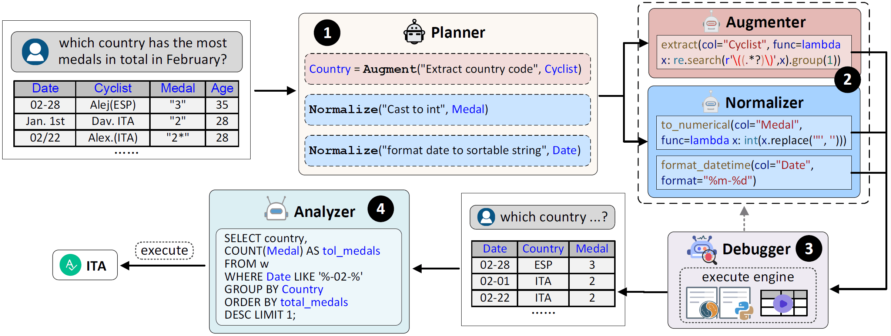

# Multi-Agent Framework for Table Processing


Tabular Question Answering (TQA) is a critical data analysis task that involves generating answers to user questions based on tabular data. Currently, Code Generation methods based on Large Language Models (LLMs) have achieved state-of-the-art (sota) performance by generating codes to extract the answer from the table for answering question. A primary challenges of these methods is that the tables are usually from websites or spreadsheets, having multiple data quality issues, which we categorize into two types: (1) column incompletion, referring to that the table lacks specific columns for answering the question and (2) inconsistency, representing that the values in the table have inconsistent formats or types. However, the current sota methods often overlook the critical step of data preparation for the data quality issues, which becomes a performance bottleneck for these methods. To address this, we propose a Automatic Data Preparation framework for TQA, which organizes efficient coordination between five LLM-based agents to automate data preparation. We also propose a pseudo code analysis based method to improve the accuracy of generating logical data prep operation. Extensive experiments on WikiTQ and TabFact show that AutoPrep achieve the best performance compared with previous sota methods. Also, when integrated with the data preparation, these methods can obtain significant performance improvement.



## Quick Start

### Environment Requirement

```bash
conda create -n muldp python=3.9.15
conda activate muldp
```

```bash
pip install -r requirements.txt
```

### Buildup Steps

1. Download the [datasets](https://pan.baidu.com/s/1osqtqDQVOBIQC4sjlnPFEA?pwd=tllm) with token <u>tllm</u> and unzip it to any path.
2. Modify the `DATA_PATH` in [global_values.py](./src/global_values.py) to the root path of your downloaded datasets.
3. Change the root path of your code file, such as `sys.path.append(rf'd:\work\MulA_Tabpro')`
4. create a key file named `keys.txt` in the root `./MulA_Tabpro` and put your api keys in it (each key for one line)

## Contributing

:heavy_exclamation_mark: Please refer to [Developer Guides](https://matchbench.github.io/md_file/DeveloperGuides.html) when comitting.