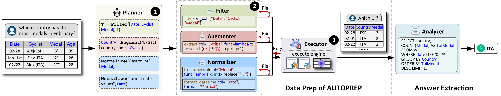

# Multi-Agent Framework for Table Processing


Answering natural language (NL) questions about tables, which is referred to as Tabular Question Answering (TQA), is important because it enables users to extract meaningful insights quickly and efficiently from structured data, bridging the gap between human language and machine-readable formats. Many of these tables originate from web sources or real-world scenarios, necessitating careful data preparation (or *data prep* for short) to ensure accurate answers. However, unlike traditional data prep, question-aware data prep introduces new requirements, which include tasks such as column augmentation and filtering for given questions, and question-aware value normalization or conversion. Because each of the above tasks is unique, a single model (or agent) may not perform effectively across all scenarios. In this paper, we propose **AUTOPREP**, a large language model (LLM)-based multi-agent framework that leverages the strengths of multiple agents, each specialized in a certain type of data prep, ensuring more accurate and contextually relevant responses. Given an NL question over a table, AUTOPREP performs data prep through three key components. **Planner**: Determines a logical plan, outlining a sequence of high-level operations. **Programmer**: Translates this logical plan into a physical plan by generating the corresponding low-level code. **Executor**: Iteratively executes and debugs the generated code to ensure correct outcomes. To support this multi-agent framework, we design a novel chain-of-thought reasoning mechanism for high-level operation suggestion, and a tool-augmented method for low-level code generation. Extensive experiments on real-world TQA datasets demonstrate that AUTOPREP can significantly improving the SOTA TQA solutions through question-aware data prep.



## Quick Start

### Environment Requirement

Create a python environment with conda:

```bash
conda create -n muldp python=3.9.15
conda activate muldp
```

Install required packages:

```bash
pip install -r requirements.txt
```

### Buildup Steps

1. Download the [datasets](https://pan.baidu.com/s/1osqtqDQVOBIQC4sjlnPFEA?pwd=tllm) with token <u>tllm</u> and unzip it to any path.
2. Modify the `DATA_PATH` in [global_values.py](./src/global_values.py) to the root path of your downloaded datasets.
3. create a key file named `keys.txt` in the root `./MulA_Tabpro` and put your api keys in it (each key for one line)
4. run `python main/experiment.py`.

## Contributing

:heavy_exclamation_mark: Please refer to [Developer Guides](https://matchbench.github.io/md_file/DeveloperGuides.html) when comitting.